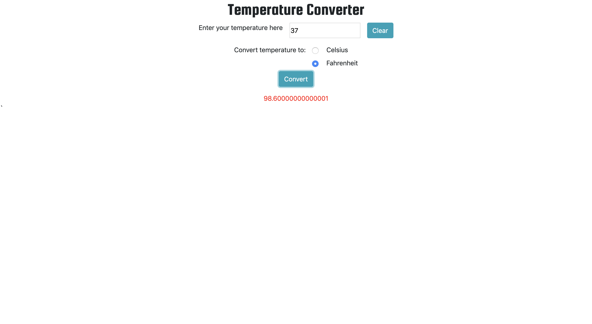

# Temperature Converter

## Description
Use this application to convert temperatures from Celsius to Fahrenheit and Fahrenheit to Celsius.

## Screenshots

## How to run
* Clone down this project.
* Install [http-server](https://www.npmjs.com/package/http-server) from npm.
* At the root of this project, run the following command: `hs -p 8080`
* In your browser, navigate to `https://localhost:8080`